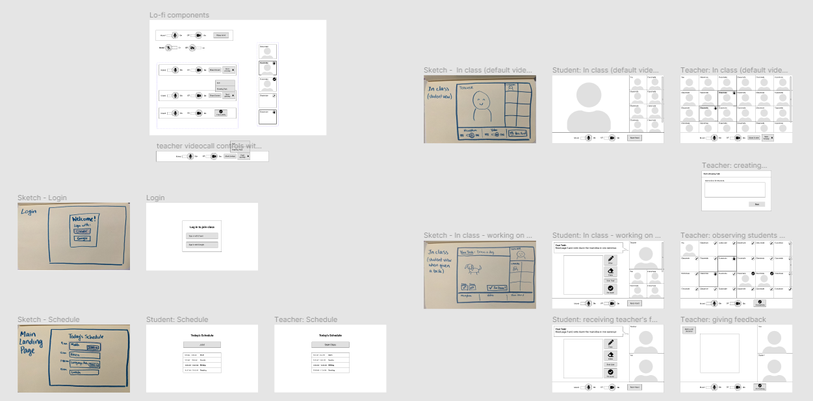
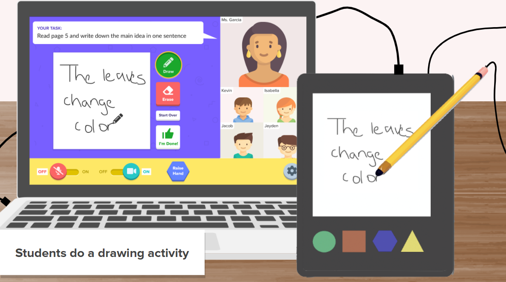

## Project Overview
In collaboration with HP, we explored the experiences of virtual elementary school classrooms to improve hands-on learning for teachers and students ages 5 to 8. I was primarily responsible for leading user research and prototyping the software component of our product.

Through this project, I learned a lot about collaborating online; I had never done a design project completely remotely before. I learned to use some new methods, such as a weighted matrix, as a part of our process. 

## Identifying Opportunities
**Stakeholders:** Initially, we created a 2x2 matrix to help us identify the key stakeholders who would be involved in our product opportunity. This helped us determine that **younger children**, **elementary school teachers**, and **those who teach hands-on subjects** are impacted by distance learning the most.

**Secondary research:** We researched online about the **social**, **economic**, and **technological** factors of remote learning and learned about the difficulties of:

- social engagement when classrooms are not in-person
- how economic inequalities affect the technological resources available (thus affecting quality of distance learning)
- how technical difficulties impact teachers and students who are not used to using so much technology.

Overall, we determined that we would center our project around elementary school teachers and students in kindergarten through third grade.

## User Research
We set out with these questions:

- How might we improve the learning experience for K-3rd grade students during remote learning and beyond?
- How might we improve the teaching experience for teachers of all skill levels and backgrounds?

**I developed our user research plan, and reached out to over 120 teachers with a survey.** From the 18 responses, we learned that the top concerns with distance learning are:

- Lack of interaction with the teacher and classmates during class.
- Lack of social activities outside of class.
- Difficulties completing/submitting assignments, and learning new material compared to pre-pandemic learning

**We interviewed 3 elementary school teachers and a school IT director** and learned:

- **It’s difficult to track students’ academic progress.** Teachers can’t walk around and see how the students are doing, or give immediate feedback as they are working. Younger students should be using pencil and paper because they’re still developing writing skills, but it’s difficult to implement that online.
- What matters most right now is **building relationships** and **maintaining a routine**.
- When asked about their thoughts on the future of learning, the teachers expressed concern and uncertainty.
- IT acts as a gatekeeper and one-stop shop for software product licenses, and advises teachers to address their needs.

**We also sat in on 3 videocall classrooms** to directly observe the dynamics of elementary school students learning online:

- Remote reading activities are difficult, and many students are still learning to read.
- It’s hard for students to stay focused; we saw many of them fidget, play with pencils, and make faces at the camera
- Remote learning is much slower than in-person learning.

## Research Synthesis
Based on our research insights, we created our teacher persona, Amy:

We organized a journey of Amy's day (click image for full size):

We decided to focus our product opportunity on the **teaching a lesson** part of the journey.

At this point we finally had enough data to revise our problem statement, since our initial problem statement being very broad about remote learning. We constructed an affinity map of opportunities based on our research insights. After 3 rounds of dot voting and discussion, we converged on a final opportunity: **How might we make remote learning more tangible/hands-on for K-3rd grade students by combining digital and physical methods?**

## Ideation
We constructed these product requirements to help guide our ideation:

- The product must be affordable and easy to use for both students and teachers.
- It must improve student engagement in class.
- It should help teachers teachers to grade and give feedback on student work
- It should help teachers to distribute work and monitor student activity

We began by each generating 10 concepts, prioritizing quantity over quality. We then did a structured group brainwriting exercise, where everyone selects three ideas of their own for someone else to brainstorm off of to create three additional ideas. We did two rounds of this exercise, then narrowed down our ~50 concepts by:

- clustering our concepts into emerging themes
- merging and deleting some redundnat ideas
- putting the ideas in a 2x2 matrix of Impact vs. Cost/Effort to Produce
- using a weighted matrix to score our ideas based on product requirements

Some of our final remaining ideas were primarily software-based and some were hardware, so we looked to combine these concepts into a single product.

## Final Concept
We wanted to build off the assumption that students already have school-issued Chromebook or other computing device that they are using for remote learning.

**Our final concept was a USB-attachable tablet with a surface for writing and drawing, and tactile buttons for video calling shortcuts.** It would come with a stylus so students can write on the surface, and pair with our custom-designed videocall web app that integrates drawing directly into the digital classroom.

Since many students already have some sort of laptop they use to attend classes, our product would support and be compatible with existing technology. 

## Prototyping
Half of our team worked on the physical prototype while the other half (including me) focused on the digital prototype.

### Physical Device Prototype
Here are some mockups of how we envisioned our product:

(lifestyle photography below provided by HP)

### Web App Prototype
I primarily worked on our web app prototype in Figma. I started out by drawing **user flow diagrams**:

Then **low-fidelity wireframing**:

As we moved into high-fidelity mockups, I kept in mind the visual language that we wanted to maintain. Since we were designing for kids who are still developing their digital literacy, we wanted to use bright colors and tactile-looking UI elements:

I chose Proxima Nova as the main font because its taller x-height gives it a friendly appearance that is easy to read.

### Product Features
Our online component would integrate with Clever, which many schools already use as their one-stop hub of classroom apps. This way, students can easily log on with a system they’re familiar with.

They can see their schedule for the day and join class with one click. This relates back to our teacher interviews where we learned that **maintaining a daily routine** is important.

In class, teachers can start a drawing activity by adding instructions and setting an optional timer.

Back on the student side, they now see the drawing interface. Whatever they draw with the tablet will show up on screen. They can also signal to the teacher with the “Raise Hand” button or “I’m Done!” button

Once the activity is started, teachers see a grid of all of their students drawings in real time. They can then select a student to see a bigger view of their drawing to give feedback on.

This addresses pain points surrounding **giving feedback on student work**.

## User Testing
We tested our prototypes with 2 teachers by walking them through the prototype on Figma, and showing pictures of the physical prototype.

Originally, we had considered letting teachers discuss questions with students in a private breakout room. However, the feedback we got pointed out two issues: first, having a teacher and student alone in a breakout room is a safety risk, and in at least some school districts, not allowed; second, unless there was another adult to supervise the rest of the students, the rest of the class cannot be left unattended. 

Some suggestions for improvement were to implement a show-and-tell feature so teachers could showcase student work, let teachers check work quickly by giving checkmarks for perfect scores and circling parts that students need to improve on, and let students save their work for later and finish them, for example, at the end of class. 

Overall, both teachers thought our product would be very useful; one of them said, **“This would be incredible, if I could have this right now and see what my kids are writing.”**

---

### Image credits
- Student and teacher avatars + laptop graphic from Freepik
- Icons from Font Awesome
- Background pattern from Subtle Patterns

