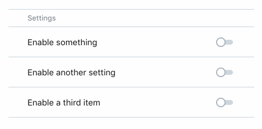
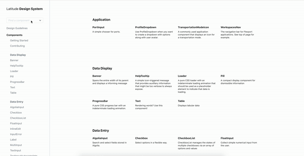
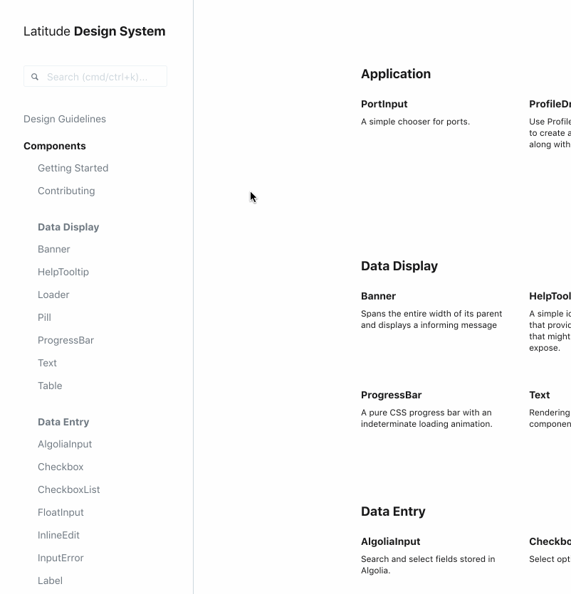
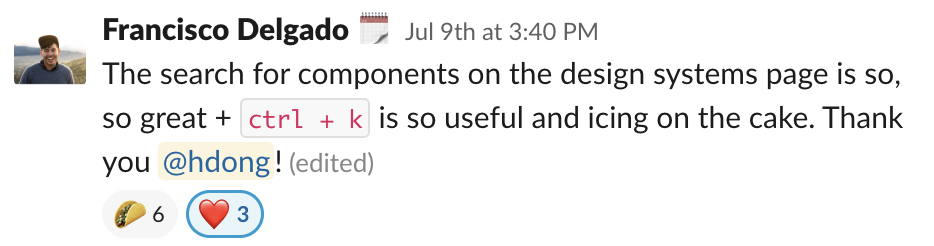
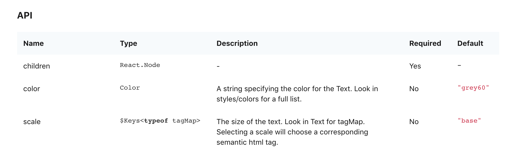
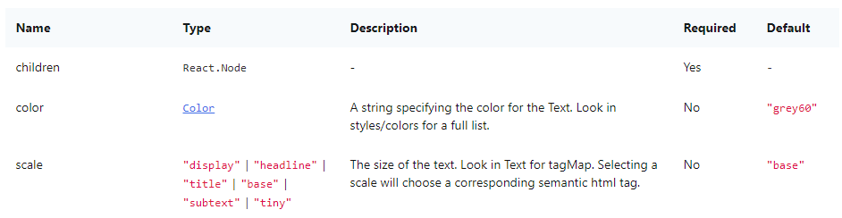
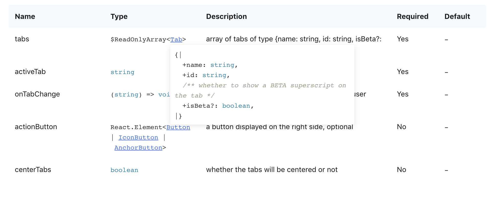
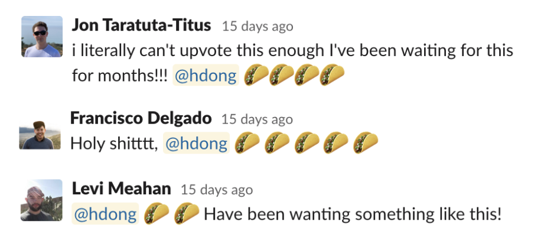

## SettingsToggle component
I brought the [SettingsToggle component](https://www.flexport.com/design/legacy/components/SettingsToggle) into Latitude.

## Search
**Problem:** The search field didn't actually search the whole site; it only filtered through the list of component names. Most engineers used `cmd+f` to find what they wanted.

**My improvements:** I added [Algolia DocSearch](https://community.algolia.com/docsearch/) to the site, which you can also try out [live](https://www.flexport.com/design/legacy/components). The site is properly indexed with [docsearch-scraper](https://github.com/algolia/docsearch-scraper), and users can now search across the docs to find design guidelines as well as components.

**Unsolicited user testimonials:** Flexport engineers liked my work!

## Prop Table
**Problem:** Let's say you're implementing a design and need to add text to the UI. You look at the documentation page for the `Text` component, and the React props are listed out like so:

However, notice the Type column—what are the actual color and size options? As a result, developers need to look into component source files to find this basic information.

**Context:** The documentation site is generated with the help of [react-docgen](https://github.com/reactjs/react-docgen/), which parses React component files. However, at the time of this writing, `docgen` doesn't support [parsing imported proptypes](https://github.com/reactjs/react-docgen/pull/352) (which is why the table above just says `Color`). Additionally, Flexport uses Flow types, but `docgen` did not parse Flow types in particular detail (which explains `$Keys<typeof tagMap>`).

**My improvements:** By parsing the `docgen` output more carefully, prop tables are now much more helpful for developers (see it [live](https://www.flexport.com/design/components/Text))!

- Props that take a color will be linked to the color system page
- Props that take an icon will be linked to the iconography page
- Enums will list out possible values
- If a prop takes another UI component, it'll link to that component's page
- If a prop takes an object, the object type will appear in a popover 

**Unsolicited user testimonials:** Flexport engineers liked my work!

