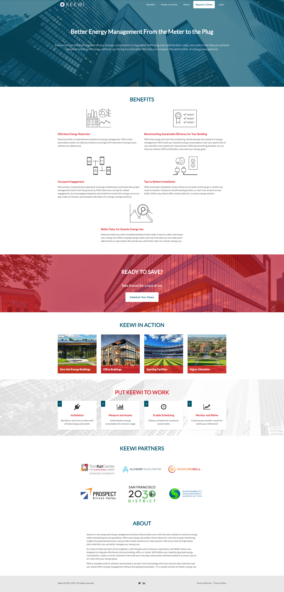

## Webapp Improvements
Implemented new features in React, fixed front-end issues, and worked with Django backend.

## Landing Page
I designed Keewi's corporate landing page and built it with Bootstrap. Check it out [live](https://www.keewi-inc.com)! I designed the icons in the Benefits section in Illustrator. I also created a custom WordPress theme that matches the landing page for their blog.

## Mobile App Redesign
I followed the human-centered design process to design their accompanying mobile app. They had already conducted user interviews, so I worked off of those to identify features, create wireframes, conduct user feedback sessions with an Invision prototype, and ultimately hand off high-fidelity mockups.

