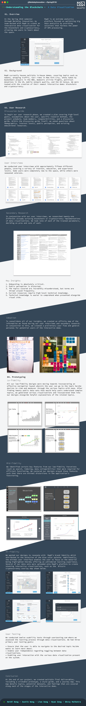

# OmniSci (previously MapD)

**Time period:** Feb 2018 – May 2018

**Team members:** Shrey Malhotra, Justin Wong, Ryan Zeng, mentored by Lian Song

**Role:** Design Consultant via [Berkeley Innovation](https://www.berkeleyinnovation.org/about-us) 

**Keywords:** product design, UI/UX design

