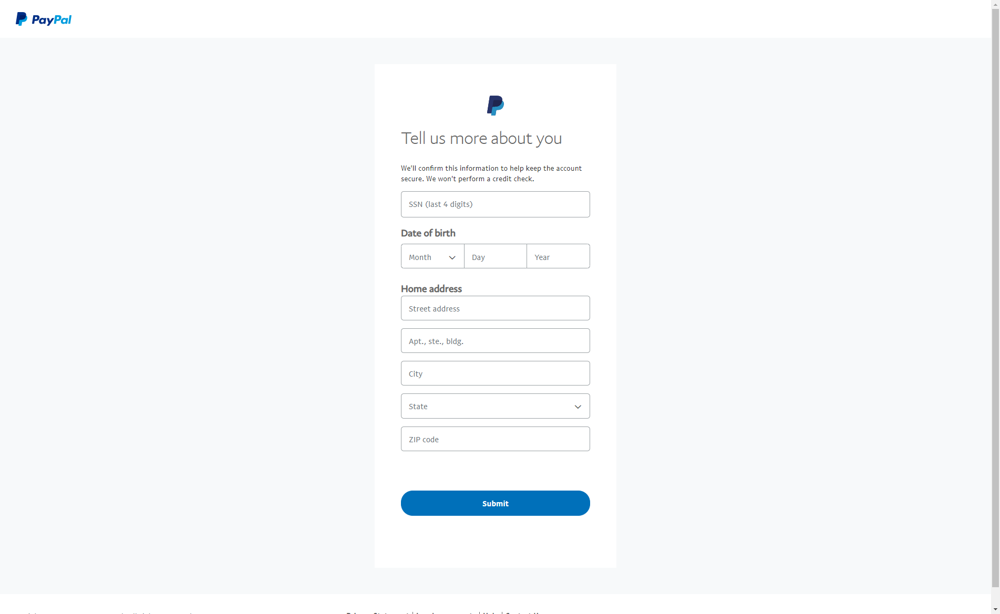
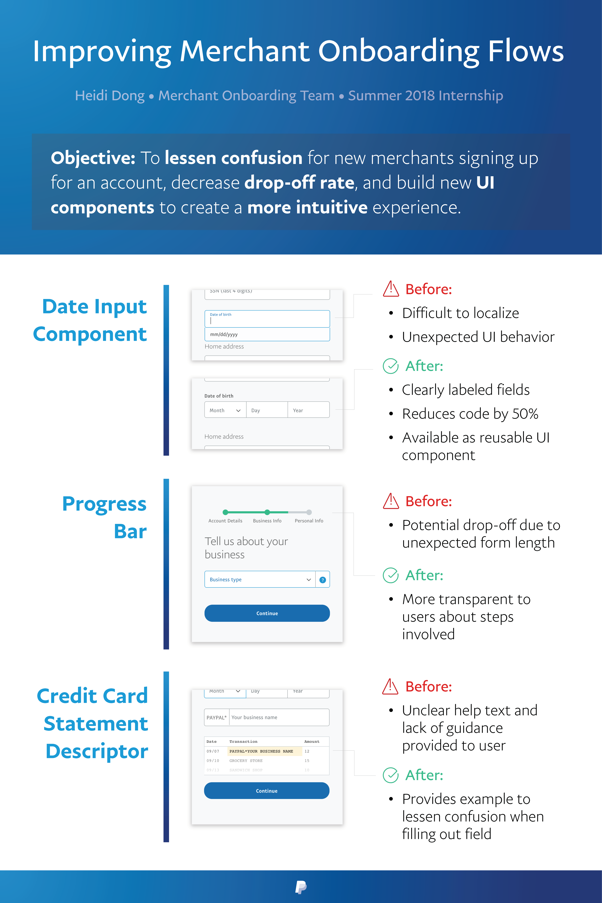

I interned on the Merchant Onboarding team in San Jose, and worked on new UI components to lessen confusion throughout the signup flow. Specifically, I created a date input component ([seen here](https://www.paypal.com/bizsignup/#/personalInfo)), progress bar, and credit card statement descriptor in React, and integrated these into the Node.js webapp.

Here's my project summarized in a poster:

Alternatively, here's the poster summarized in an amusing video:

<iframe src="https://drive.google.com/file/d/1UdKzEZ_9JpF2civrumDQqvds7BUP4Xt-/preview" style="width: 100%; height: 500px;"></iframe>
